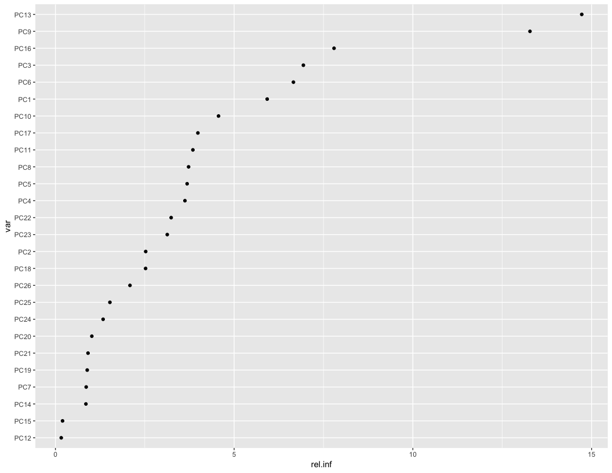

## Executive Summary

Created a prediction model to predict outcomes for 20 samples by:

1. Importing training and testing data

2. Tidying the training and testing data

3. Transforming the training and testing data

4. Summarizing the training data

5. Modeling the training data and evaluating the in-sample and out-of-sample errors

6. Communicating the 20 predicted outcomes

## Import

Downloaded training data from: https://d396qusza40orc.cloudfront.net/predmachlearn/pml-training.csv

Downloaded testing data from: https://d396qusza40orc.cloudfront.net/predmachlearn/pml-testing.csv


```r
training <- read.csv("pml-training.csv", as.is = TRUE) # prevent character variables from being converted to factors
testing  <- read.csv("pml-testing.csv", as.is = TRUE)  # prevent character variables from being converted to factors
```

## Tidy

Remove row counter "X" from both training and testing data frames and convert `classe` from a character to a factor:


```r
training$X <- NULL
testing$X <- NULL

training$classe <- as.factor(training$classe)
```

## Transform

Identify uninformative variables in`training` using `nearZeroVar` function:


```r
training_nzv <- nearZeroVar(training, saveMetrics = TRUE)
training_nzv[training_nzv$nzv, ]
```

```
                         freqRatio percentUnique zeroVar  nzv
new_window                47.33005    0.01019264   FALSE TRUE
kurtosis_roll_belt      1921.60000    2.02323922   FALSE TRUE
kurtosis_picth_belt      600.50000    1.61553358   FALSE TRUE
kurtosis_yaw_belt         47.33005    0.01019264   FALSE TRUE
skewness_roll_belt      2135.11111    2.01304658   FALSE TRUE
skewness_roll_belt.1     600.50000    1.72255631   FALSE TRUE
skewness_yaw_belt         47.33005    0.01019264   FALSE TRUE
max_yaw_belt             640.53333    0.34654979   FALSE TRUE
min_yaw_belt             640.53333    0.34654979   FALSE TRUE
amplitude_yaw_belt        50.04167    0.02038528   FALSE TRUE
avg_roll_arm              77.00000    1.68178575   FALSE TRUE
stddev_roll_arm           77.00000    1.68178575   FALSE TRUE
var_roll_arm              77.00000    1.68178575   FALSE TRUE
avg_pitch_arm             77.00000    1.68178575   FALSE TRUE
stddev_pitch_arm          77.00000    1.68178575   FALSE TRUE
var_pitch_arm             77.00000    1.68178575   FALSE TRUE
avg_yaw_arm               77.00000    1.68178575   FALSE TRUE
stddev_yaw_arm            80.00000    1.66649679   FALSE TRUE
var_yaw_arm               80.00000    1.66649679   FALSE TRUE
kurtosis_roll_arm        246.35897    1.68178575   FALSE TRUE
kurtosis_picth_arm       240.20000    1.67159311   FALSE TRUE
kurtosis_yaw_arm        1746.90909    2.01304658   FALSE TRUE
skewness_roll_arm        249.55844    1.68688207   FALSE TRUE
skewness_pitch_arm       240.20000    1.67159311   FALSE TRUE
skewness_yaw_arm        1746.90909    2.01304658   FALSE TRUE
max_roll_arm              25.66667    1.47793293   FALSE TRUE
min_roll_arm              19.25000    1.41677709   FALSE TRUE
min_pitch_arm             19.25000    1.47793293   FALSE TRUE
amplitude_roll_arm        25.66667    1.55947406   FALSE TRUE
amplitude_pitch_arm       20.00000    1.49831821   FALSE TRUE
kurtosis_roll_dumbbell  3843.20000    2.02833554   FALSE TRUE
kurtosis_picth_dumbbell 9608.00000    2.04362450   FALSE TRUE
kurtosis_yaw_dumbbell     47.33005    0.01019264   FALSE TRUE
skewness_roll_dumbbell  4804.00000    2.04362450   FALSE TRUE
skewness_pitch_dumbbell 9608.00000    2.04872082   FALSE TRUE
skewness_yaw_dumbbell     47.33005    0.01019264   FALSE TRUE
max_yaw_dumbbell         960.80000    0.37203139   FALSE TRUE
min_yaw_dumbbell         960.80000    0.37203139   FALSE TRUE
amplitude_yaw_dumbbell    47.92020    0.01528896   FALSE TRUE
kurtosis_roll_forearm    228.76190    1.64101519   FALSE TRUE
kurtosis_picth_forearm   226.07059    1.64611151   FALSE TRUE
kurtosis_yaw_forearm      47.33005    0.01019264   FALSE TRUE
skewness_roll_forearm    231.51807    1.64611151   FALSE TRUE
skewness_pitch_forearm   226.07059    1.62572623   FALSE TRUE
skewness_yaw_forearm      47.33005    0.01019264   FALSE TRUE
max_roll_forearm          27.66667    1.38110284   FALSE TRUE
max_yaw_forearm          228.76190    0.22933442   FALSE TRUE
min_roll_forearm          27.66667    1.37091020   FALSE TRUE
min_yaw_forearm          228.76190    0.22933442   FALSE TRUE
amplitude_roll_forearm    20.75000    1.49322189   FALSE TRUE
amplitude_yaw_forearm     59.67702    0.01528896   FALSE TRUE
avg_roll_forearm          27.66667    1.64101519   FALSE TRUE
stddev_roll_forearm       87.00000    1.63082255   FALSE TRUE
var_roll_forearm          87.00000    1.63082255   FALSE TRUE
avg_pitch_forearm         83.00000    1.65120783   FALSE TRUE
stddev_pitch_forearm      41.50000    1.64611151   FALSE TRUE
var_pitch_forearm         83.00000    1.65120783   FALSE TRUE
avg_yaw_forearm           83.00000    1.65120783   FALSE TRUE
stddev_yaw_forearm        85.00000    1.64101519   FALSE TRUE
var_yaw_forearm           85.00000    1.64101519   FALSE TRUE
```

Remove uninformative variables from `training` and save as `training2`:


```r
training2 <- training %>% 
  dplyr::select(names(training)[!training_nzv$nzv])
```

Create indicator variables for `user_name` so they can be used in machine learning algorithms and remove `user_name`:


```r
train_users <- dummyVars(
  ~ user_name,
  data = training2
)

test_users <- dummyVars(
  ~ user_name,
  data = testing
)

train_usersVar <- data.frame(predict(train_users, newdata = training2))
test_usersVar  <- data.frame(predict(test_users, newdata = testing))

training2 <- data.frame(train_usersVar[ , -1], training2[ , -1]) 
testing2  <- data.frame(test_usersVar[ , -1], testing[ , -1]) 
```

Convert `cvtd_timestamp` from character to numeric:


```r
training2$cvtd_timestamp <- as.numeric(ymd_hms(training2$cvtd_timestamp))
testing2$cvtd_timestamp  <- as.numeric(ymd_hms(testing2$cvtd_timestamp))
```

Eliminate variables with significant missing values:


```r
training2 <- training2[colSums(is.na(training2))/nrow(training2) < 0.1]
```

Create training and testing subsets from `training2` to evaluate in-sample and out-of-sample error:


```r
set.seed(123)

use <- createDataPartition(
  y = training2$classe,
  p = 0.70,
  list = FALSE
)
use_train <- training2[ use, ]
use_test  <- training2[-use, ]
```

## Summarize

With 62 variables left in the training set, detailed visualizations would require many pages of output and would likely not be informative for such high-dimensional data. So instead a simple table and summary statistics are provided.

Table of outcome factor `classe` level counts:


```r
table(use_train$classe)
```

```

   A    B    C    D    E 
3906 2658 2396 2252 2525 
```

Summary of all variables used in training set:


```r
skim_with(integer = list(hist = NULL, p25 = NULL, p75 = NULL), numeric = list(hist = NULL, p25 = NULL, p75 = NULL)) 
use_train %>% skim() %>% kable()
```

```
Skim summary statistics  
 n obs: 13737    
 n variables: 62    

Variable type: factor

 variable    missing    complete      n      n_unique                top_counts                ordered 
----------  ---------  ----------  -------  ----------  ------------------------------------  ---------
  classe        0        13737      13737       5        A: 3906, B: 2658, E: 2525, C: 2396     FALSE  

Variable type: integer

       variable          missing    complete      n       mean         sd          p0         p50       p100   
----------------------  ---------  ----------  -------  ---------  -----------  ---------  ---------  ---------
     accel_arm_x            0        13737      13737    -60.58      181.38       -404        -43        437   
     accel_arm_y            0        13737      13737     33.13      109.72       -318        14         303   
     accel_arm_z            0        13737      13737    -71.16      135.56       -636        -46        271   
     accel_belt_x           0        13737      13737     -5.58       29.72       -120        -15        83    
     accel_belt_y           0        13737      13737     30.05       28.61        -69        33         164   
     accel_belt_z           0        13737      13737    -72.36      100.64       -275       -152        105   
   accel_dumbbell_x         0        13737      13737    -28.76       67.36       -419        -8         235   
   accel_dumbbell_y         0        13737      13737     52.51       80.75       -182        42         315   
   accel_dumbbell_z         0        13737      13737    -38.28      109.61       -319        -1         318   
   accel_forearm_x          0        13737      13737    -61.52      180.18       -498        -56        477   
   accel_forearm_y          0        13737      13737    164.07      200.05       -632        201        923   
   accel_forearm_z          0        13737      13737    -54.88      138.88       -446        -39        291   
     magnet_arm_x           0        13737      13737     190.3      443.19       -580        284        782   
     magnet_arm_y           0        13737      13737    157.01      201.85       -392        202        582   
     magnet_arm_z           0        13737      13737     307.2       326.8       -597        445        694   
    magnet_belt_x           0        13737      13737     55.62       64.09        -52        35         485   
    magnet_belt_y           0        13737      13737    593.48       35.68        354        601        673   
    magnet_belt_z           0        13737      13737    -345.91      65.65       -623       -320        293   
  magnet_dumbbell_x         0        13737      13737    -328.4      339.67       -643       -479        592   
  magnet_dumbbell_y         0        13737      13737    220.28      327.45       -3600       310        633   
   magnet_forearm_x         0        13737      13737    -312.88     347.55       -1280      -380        672   
      num_window            0        13737      13737     429.1      247.78         1         421        864   
 raw_timestamp_part_1       0        13737      13737    1.3e+09    205501.5     1.3e+09    1.3e+09    1.3e+09 
 raw_timestamp_part_2       0        13737      13737     5e+05     288557.72      294      494727      1e+06  
   total_accel_arm          0        13737      13737     25.51       10.53         1         27         66    
   total_accel_belt         0        13737      13737     11.3        7.76          0         17         29    
 total_accel_dumbbell       0        13737      13737     13.72       10.24         0         10         58    
 total_accel_forearm        0        13737      13737     34.72       10.05         0         36         108   

Variable type: numeric

     variable         missing    complete      n       mean        sd         p0         p50       p100   
-------------------  ---------  ----------  -------  ---------  ---------  ---------  ---------  ---------
  cvtd_timestamp         0        13737      13737    1.4e+09    3.8e+08     1e+09     1.1e+09    1.9e+09 
    gyros_arm_x          0        13737      13737     0.053      1.99       -6.37      0.08       4.87   
    gyros_arm_y          0        13737      13737     -0.26      0.85       -3.44      -0.24      2.81   
    gyros_arm_z          0        13737      13737     0.27       0.55       -2.28      0.23       3.02   
   gyros_belt_x          0        13737      13737    -0.0051     0.21        -1        0.03       2.22   
   gyros_belt_y          0        13737      13737     0.039      0.078      -0.64      0.02       0.56   
   gyros_belt_z          0        13737      13737     -0.13      0.24       -1.46      -0.1       1.62   
 gyros_dumbbell_x        0        13737      13737     0.15       1.79       -204       0.13       2.22   
 gyros_dumbbell_y        0        13737      13737     0.051      0.66       -2.06      0.05        52    
 gyros_dumbbell_z        0        13737      13737     -0.12      2.73       -2.38      -0.13       317   
  gyros_forearm_x        0        13737      13737     0.16       0.66        -22       0.05       3.97   
  gyros_forearm_y        0        13737      13737     0.082      3.43       -6.65      0.03        311   
  gyros_forearm_z        0        13737      13737     0.16       2.06       -8.09      0.08        231   
 magnet_dumbbell_z       0        13737      13737     46.89     140.28      -262        14         451   
 magnet_forearm_y        0        13737      13737    380.49     510.11      -890        591       1480   
 magnet_forearm_z        0        13737      13737    391.82     371.05      -966        511       1090   
     pitch_arm           0        13737      13737     -4.67      30.65      -88.8        0        88.5   
    pitch_belt           0        13737      13737     0.32       22.32      -55.8      5.28       60.3   
  pitch_dumbbell         0        13737      13737    -10.96      36.92     -149.59     -21.2      149.4  
   pitch_forearm         0        13737      13737     10.65      28.15      -72.5      9.29       89.8   
     roll_arm            0        13737      13737     17.9        73        -180         0         180   
     roll_belt           0        13737      13737     64.25      62.81      -28.9       113        162   
   roll_dumbbell         0        13737      13737     23.62      69.89     -153.71     48.09     153.38  
   roll_forearm          0        13737      13737     33.46     108.24      -180       22.3        180   
 user_namecarlitos       0        13737      13737     0.16       0.37         0          0          1    
 user_namecharles        0        13737      13737     0.18       0.38         0          0          1    
  user_nameeurico        0        13737      13737     0.16       0.37         0          0          1    
  user_namejeremy        0        13737      13737     0.17       0.38         0          0          1    
  user_namepedro         0        13737      13737     0.13       0.34         0          0          1    
      yaw_arm            0        13737      13737     -0.29      71.32      -180         0         180   
     yaw_belt            0        13737      13737    -11.52      95.15      -180       -13.8       179   
   yaw_dumbbell          0        13737      13737     1.63       82.65     -150.87     -3.85     154.95  
    yaw_forearm          0        13737      13737     19.99     103.11      -180         0         180   
```

## Model

**Correlation analysis:**


```r
M <- abs(cor(use_train[, -62]))
diag(M) <- 0 # remove 1s on diag
rc <- which(M > 0.8, arr.ind = TRUE)
rc
```

```
                  row col
magnet_dumbbell_z  48   3
gyros_belt_x       14   5
magnet_dumbbell_x  46   5
magnet_dumbbell_y  47   5
yaw_belt           12  10
total_accel_belt   13  10
accel_belt_y       18  10
accel_belt_z       19  10
accel_belt_x       17  11
magnet_belt_x      20  11
roll_belt          10  12
roll_belt          10  13
accel_belt_y       18  13
accel_belt_z       19  13
user_namepedro      5  14
pitch_belt         11  17
magnet_belt_x      20  17
roll_belt          10  18
total_accel_belt   13  18
accel_belt_z       19  18
roll_belt          10  19
total_accel_belt   13  19
accel_belt_y       18  19
pitch_belt         11  20
accel_belt_x       17  20
gyros_arm_y        28  27
gyros_arm_x        27  28
magnet_arm_x       33  30
accel_arm_x        30  33
magnet_arm_z       35  34
magnet_arm_y       34  35
accel_dumbbell_x   43  37
accel_dumbbell_z   45  38
gyros_dumbbell_z   42  40
gyros_forearm_z    55  40
gyros_dumbbell_x   40  42
gyros_forearm_z    55  42
pitch_dumbbell     37  43
yaw_dumbbell       38  45
user_namepedro      5  46
user_namepedro      5  47
user_nameeurico     3  48
gyros_forearm_z    55  54
gyros_dumbbell_x   40  55
gyros_dumbbell_z   42  55
gyros_forearm_y    54  55
```

```r
dim(rc)
```

```
[1] 46  2
```

46 pairs of input variables have correlation coefficients greater than 0.8.

**Prediction model:**

Used Gradient Boosted Model (`gbm`) with Principle Component Analysis (PCA) using centered and scaled input variables:

- PCA was used due to the high number of input variables pairs with correlation coefficients greater than 0.8 (46)

- Centering and scaling were used to eliminate the risk of some variables dominating due to their measurement scale

- `gmb` was used because it generally provides better results than Recursive Partitioning (`rpart`) and Random Forest (`rf`) methods, two other methods appropriate for multivariate outcome classification problems (and `rf` never finished on my PC)


```r
set.seed(123)

modelFit <- train(
  classe ~ .,
  method = "gbm",
  preProcess = c("center", "scale", "pca"),
  verbose = FALSE,
  data = use_train
)
```

The final model identified 26 PCA predictors from the 61 input variables:


```r
modelFit$finalModel
```

```
A gradient boosted model with multinomial loss function.
150 iterations were performed.
There were 26 predictors of which 26 had non-zero influence.
```

Relative Influence of 26 Principle Components (PCs):


```r
relInf <- summary(modelFit, plotit = FALSE)
relInf
```

```
      var    rel.inf
PC13 PC13 14.7249691
PC9   PC9 13.2768363
PC16 PC16  7.7950406
PC3   PC3  6.9372323
PC6   PC6  6.6586798
PC1   PC1  5.9244599
PC10 PC10  4.5633739
PC17 PC17  3.9858998
PC11 PC11  3.8456264
PC8   PC8  3.7255311
PC5   PC5  3.6847251
PC4   PC4  3.6235586
PC22 PC22  3.2377252
PC23 PC23  3.1283266
PC2   PC2  2.5256997
PC18 PC18  2.5225523
PC26 PC26  2.0859927
PC25 PC25  1.5242042
PC24 PC24  1.3342788
PC20 PC20  1.0187198
PC21 PC21  0.9118241
PC19 PC19  0.8894082
PC7   PC7  0.8604542
PC14 PC14  0.8529972
PC15 PC15  0.1992891
PC12 PC12  0.1625950
```

```r
relInf$var <- factor(relInf$var, levels = relInf$var[order(relInf$rel.inf)])
ggplot(relInf, aes(rel.inf, var)) +
  geom_point()
```

<!-- -->

In-sample error from training set: 


```r
confusionMatrix(
  use_train$classe,
  predict(modelFit, use_train)
)
```

```
Confusion Matrix and Statistics

          Reference
Prediction    A    B    C    D    E
         A 3568  102   98  119   19
         B  180 2188  205   46   39
         C  113  141 2073   45   24
         D   56   48  266 1856   26
         E   54  116  127   81 2147

Overall Statistics
                                          
               Accuracy : 0.8613          
                 95% CI : (0.8554, 0.8671)
    No Information Rate : 0.2891          
    P-Value [Acc > NIR] : < 2.2e-16       
                                          
                  Kappa : 0.8245          
 Mcnemar's Test P-Value : < 2.2e-16       

Statistics by Class:

                     Class: A Class: B Class: C Class: D Class: E
Sensitivity            0.8985   0.8432   0.7486   0.8645   0.9521
Specificity            0.9654   0.9578   0.9706   0.9658   0.9671
Pos Pred Value         0.9135   0.8232   0.8652   0.8242   0.8503
Neg Pred Value         0.9590   0.9633   0.9386   0.9747   0.9904
Prevalence             0.2891   0.1889   0.2016   0.1563   0.1642
Detection Rate         0.2597   0.1593   0.1509   0.1351   0.1563
Detection Prevalence   0.2843   0.1935   0.1744   0.1639   0.1838
Balanced Accuracy      0.9320   0.9005   0.8596   0.9151   0.9596
```

The overall in-sample accuracy is 86%.

Expected out-of-sample error from test set: 


```r
confusionMatrix(
  use_test$classe,
  predict(modelFit, use_test)
)
```

```
Confusion Matrix and Statistics

          Reference
Prediction    A    B    C    D    E
         A 1474   51   66   77    6
         B   92  883  108   25   31
         C   80   85  827   26    8
         D   24   30  128  756   26
         E   47   72   54   37  872

Overall Statistics
                                          
               Accuracy : 0.8177          
                 95% CI : (0.8076, 0.8275)
    No Information Rate : 0.2918          
    P-Value [Acc > NIR] : < 2.2e-16       
                                          
                  Kappa : 0.7692          
 Mcnemar's Test P-Value : < 2.2e-16       

Statistics by Class:

                     Class: A Class: B Class: C Class: D Class: E
Sensitivity            0.8585   0.7877   0.6991   0.8208   0.9247
Specificity            0.9520   0.9463   0.9577   0.9581   0.9575
Pos Pred Value         0.8805   0.7752   0.8060   0.7842   0.8059
Neg Pred Value         0.9423   0.9499   0.9267   0.9665   0.9852
Prevalence             0.2918   0.1905   0.2010   0.1565   0.1602
Detection Rate         0.2505   0.1500   0.1405   0.1285   0.1482
Detection Prevalence   0.2845   0.1935   0.1743   0.1638   0.1839
Balanced Accuracy      0.9052   0.8670   0.8284   0.8895   0.9411
```

The overall out-of-sample accuracy is 82%.

## Communicate

Using prediction model to predict 20 different test cases:


```r
testing$pred <- predict(modelFit, testing2)
testing[ , c("problem_id", "pred")]
```

```
   problem_id pred
1           1    A
2           2    A
3           3    C
4           4    A
5           5    A
6           6    C
7           7    D
8           8    D
9           9    A
10         10    A
11         11    B
12         12    C
13         13    B
14         14    A
15         15    E
16         16    E
17         17    A
18         18    B
19         19    B
20         20    B
```
